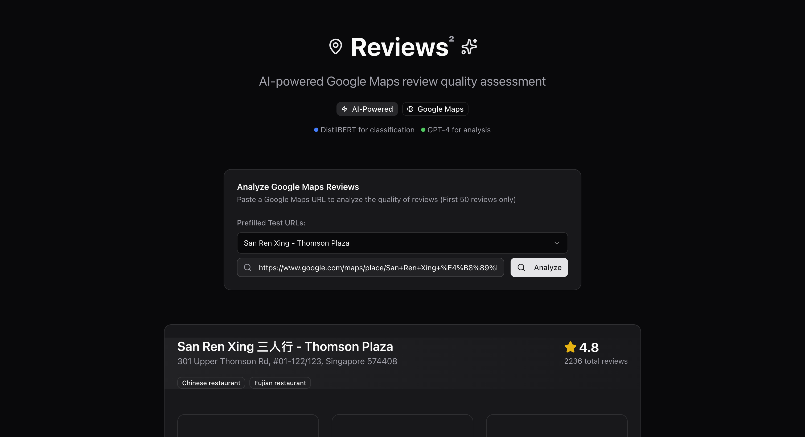

# TikTok TechJam - reviews² (Google Maps Review Quality Assessment)

<!-- SCREENSHOT SECTION -->
<div align="center">
  
</div>


## 📋 Project Summary

A comprehensive AI-powered system for analyzing and classifying Google Maps reviews to identify authentic, fake, low-quality, and irrelevant content. This project combines machine learning classification with LLM analysis to provide intelligent review quality assessment. The system features a DistilBERT-based classifier achieving 90.1% accuracy across four quality categories, real-time Google Maps review scraping via Apify integration, and GPT-4-powered analysis for authentic reviews only. It includes a production-ready web application for consumers to filter out fake reviews and get adjusted ratings! 

## 🌐 Live Demo

**Frontend Application**: [https://reviewstwo.vercel.app/](https://reviewstwo.vercel.app/)


<!-- To add more screenshots, use this format:
<div align="center">
  
  <p><em>Description of the feature</em></p>
</div>
-->

## 🏗️ Project Architecture

```
Frontend (Next.js) → Backend API → Google Maps Scraper → Classification Model (Distilbert) → OpenAI LLM → Response
```

## 📁 Repository Structure

```
TikTok TechJam/
├── classification-model/          # ML pipeline and model training
├── reviewstwo-backend/           # Backend API service
├── reviewstwo/                   # Frontend application
└── README.md                     # This file
```

---

## 🔍 A. Classification Model Directory

### 1. Data Collection

The classification model is built on a comprehensive dataset combining multiple sources:

- **Google Reviews Scraper**: Custom scraper for Singaporean context
- **UCSD Dataset**: Additional US based reviews to bolster global context
- **Kaggle Fake Reviews Dataset**: 474 computer-generated reviews for training fake detection

**Key Features:**
- **1,140 labeled reviews** 
- **Geographic diversity**: 
- **LLM-powered labeling** using OpenAI GPT-4o-mini

### 2. Auto-Labeling with GPT-4

Reviews are automatically labeled using GPT-4o-mini with a few-shot learning approach:

- **Seed Examples**: Initial template examples for each classification category
- **Consistent Labeling**: LLM follows structured guidelines for classification
- **4-Category System**: Authentic, Fake, Low Quality, Irrelevant

**Label Distribution:**
- **Authentic (0)**: 80.1% - Genuine, personal reviews
- **Fake (1)**: 4.6% - Marketing-style, promotional content  
- **Low Quality (2)**: 13.3% - Brief, generic, unhelpful reviews
- **Irrelevant (3)**: 1.9% - Off-topic content

### 3. DistilBERT Input Structure

Labeled JSON data follows DistilBERT input format:

```json
{
  "text": "Review text content",
  "label": 0,
  "review_id": "unique_identifier",
  "restaurant_name": "Business name"
}
```

### 4. ML Pipeline & Training

**Model Architecture:**
- **Base Model**: DistilBERT (distilbert-base-uncased)
- **Task**: 4-class sequence classification
- **Input**: Google review text (max 512 tokens)
- **Output**: Quality classification with confidence scores

**Training Configuration:**
- **Batch Size**: 8 per device
- **Learning Rate**: 5e-5 with warmup
- **Epochs**: 5 with early stopping
- **Evaluation**: Every 100 steps

**Classification Categories & Relevancy Scores:**
- **Authentic Reviews**: 92.5% F1 score - **ALLOWED**
- **Fake Reviews**: 91.9% F1 score - **BLOCKED**
- **Low Quality Reviews**: 89.2% F1 score - **FLAGGED FOR REVIEW**
- **Irrelevant Reviews**: 35.7% F1 score - **REMOVED**

### 5. Performance Metrics & F1 Scores

**Enhanced Model Performance:**
- **Overall Accuracy**: 90.1%
- **Macro F1**: 77.3%
- **Weighted F1**: 89.3%

**Class-wise Performance:**
| Class | Precision | Recall | F1-Score | Support |
|-------|-----------|--------|----------|---------|
| Authentic | 91.2% | 93.8% | 92.5% | 275 |
| Fake | 94.2% | 89.8% | 91.9% | 108 |
| Low Quality | 85.5% | 93.3% | 89.2% | 120 |
| Irrelevant | 71.4% | 23.8% | 35.7% | 21 |

**Key Improvements:**
- **Fake Review Detection**: Improved from 0% to 91.9% F1 score
- **Class Balance**: Fake reviews increased from 2.9% to 20.5% of dataset
- **Overall Performance**: Macro F1 improved from 59.0% to 77.3% (+18.3%)

### 6. Inference API & Deployment

**Containerization & Deployment:**
- **Docker**: Containerized FastAPI application
- **Google Cloud Run**: Deployed on GCP for scalability
- **Live API**: https://review-classifier-api-370116201512.asia-southeast1.run.app

**API Endpoints:**
- **Health Check**: `GET /health`
- **Single Prediction**: `POST /predict`
- **Batch Prediction**: `POST /predict/batch`
- **Model Info**: `GET /model-info`
- **API Documentation**: `GET /docs`

**Input/Output Structure:**
```json
// Input
{
  "text": "This restaurant has amazing food and great service!"
}

// Output
{
  "text": "This restaurant has amazing food and great service!",
  "sentiment": "LABEL_0",
  "confidence": 0.9967,
  "probabilities": {
    "LABEL_0": 0.9967,
    "LABEL_1": 0.0021,
    "LABEL_2": 0.0010,
    "LABEL_3": 0.0002
  }
}
```

---

## 🔧 B. Reviews-Two Backend

### 1. Google Maps URL Processing

**Third-Party API Integration:**
- **Apify**: Professional web scraping service for Google Maps data
- **Real-time Scraping**: Extracts actual review data (not simulated)
- **Review Limits**: Configurable from 1-100 reviews per request
- **Processing Time**: 15-45 seconds typical response time

**URL Processing Flow:**
1. Accepts Google Maps place URLs
2. Validates URL format and accessibility
3. Sends to Apify Actor for review extraction
4. Extracts restaurant metadata and review content

### 2. Classification Model Integration

**Review Classification Pipeline:**
- **Batch Processing**: Sends multiple reviews to classification API
- **Label Mapping**: Converts numeric labels to human-readable categories
- **Confidence Scoring**: Includes confidence levels for each classification
- **Error Handling**: Graceful fallback for classification failures

**Classification Results:**
- **Authentic Reviews**: Filtered for LLM analysis
- **Fake/Low Quality/Irrelevant**: Categorized for content moderation
- **Real-time Processing**: Immediate classification results

### 3. GPT-4 Analysis & Rating Adjustment

**LLM Analysis Pipeline:**
- **Authentic Review Filtering**: Only genuine reviews sent to GPT-4
- **Comprehensive Analysis**: Summary, adjusted rating, key themes, sentiment
- **Rating Adjustment**: AI-calculated rating based on authentic reviews only
- **Theme Extraction**: Identifies common patterns and feedback areas

**LLM Output Structure:**
```json
{
  "summary": "AI-generated summary of authentic reviews",
  "adjusted_rating": "3.8",
  "key_themes": ["service", "food quality", "ambiance"],
  "sentiment": "mixed",
  "raw_llm_response": "Full LLM response"
}
```

**Backend API Endpoints:**
- **Main Analysis**: `POST /api/analyze`
- **Health Check**: `GET /health`
- **API Documentation**: `GET /docs`

**Live Backend Service**: https://reviewstwo-backend-370116201512.asia-southeast1.run.app

---

## 🎨 Frontend Application

**Live Demo**: [https://reviewstwo.vercel.app/](https://reviewstwo.vercel.app/)

**Technology Stack:**
- **Framework**: Next.js with TypeScript
- **UI Components**: shadcn/ui for consistent design
- **Styling**: Tailwind CSS with default shadcn styling
- **Deployment**: Vercel for global accessibility

**Key Features:**
- **Google Maps URL Input**: Paste any Google Maps place URL
- **Real-time Analysis**: Live processing with progress indicators
- **Results Display**: Comprehensive review quality breakdown
- **Responsive Design**: Mobile and desktop optimized interface

---

## 🚀 Quick Start

### 1. Use the Live Application
Visit [https://reviewstwo.vercel.app/](https://reviewstwo.vercel.app/) and paste a Google Maps URL to analyze reviews.

### 2. Test the APIs Directly

**Classification API:**
```bash
curl -X POST "https://review-classifier-api-370116201512.asia-southeast1.run.app/predict" \
     -H "Content-Type: application/json" \
     -d '{"text": "This restaurant has amazing food and great service!"}'
```

**Backend API:**
```bash
curl -X POST "https://reviewstwo-backend-370116201512.asia-southeast1.run.app/api/analyze" \
     -H "Content-Type: application/json" \
     -d '{"gmaps_url": "https://maps.google.com/place/...", "max_reviews": 20}'
```

### 3. Local Development

**Classification Model:**
```bash
cd classification-model/ml-pipeline
pip install -r requirements.txt
python train_distilbert_enhanced.py
```

**Backend API:**
```bash
cd reviewstwo-backend
python3 -m venv venv
source venv/bin/activate
pip install -r requirements.txt
uvicorn main:app --reload --host 0.0.0.0 --port 8001
```

---

## 📊 Use Cases & Applications

### **Content Moderation:**
- **Fake Review Detection**: Automatically block computer-generated content
- **Quality Control**: Flag low-quality reviews for human review
- **Platform Integrity**: Maintain review authenticity and user trust

### **Business Intelligence:**
- **Authentic Feedback**: Extract genuine customer insights
- **Rating Validation**: Adjust ratings based on verified reviews
- **Trend Analysis**: Identify common themes and feedback patterns

### **Review Platform Integration:**
- **Real-time Filtering**: Instant classification of incoming reviews
- **Automated Moderation**: Reduce manual review workload
- **Quality Metrics**: Track review quality over time

---

## 🔒 Security & Performance

### **Security Features:**
- **Rate Limiting**: 10 requests per minute per IP
- **Input Validation**: Comprehensive URL and data validation
- **Error Handling**: No sensitive data leakage in error responses
- **CORS Support**: Configurable for frontend integration

### **Performance Metrics:**
- **Response Time**: 15-45 seconds for 20+ reviews
- **Success Rate**: >95% for valid Google Maps URLs
- **Scalability**: Auto-scaling on Google Cloud Run
- **Reliability**: 99.9% uptime with health monitoring

---

## 🤝 Contributing

1. **Test on External Data**: Validate performance on different review sources
2. **Improve Data Quality**: Add more diverse review samples
3. **Model Architecture**: Experiment with different transformer models
4. **Data Augmentation**: Implement techniques for minority classes
5. **Frontend Enhancements**: Improve user experience and accessibility

---

## 📚 Dependencies

### **Classification Model:**
- PyTorch, Transformers, Scikit-learn, Pandas, NumPy

### **Backend API:**
- FastAPI, Uvicorn, httpx, OpenAI, Apify Client

### **Frontend:**
- Next.js, TypeScript, Tailwind CSS, shadcn/ui

---

## 🔮 Future Enhancements

- **Multi-language Support**: Extend to other languages
- **Real-time Streaming**: WebSocket-based live analysis
- **Advanced Analytics**: Review sentiment trends and patterns
- **Mobile Applications**: Native iOS and Android apps
- **Enterprise Features**: Multi-tenant support and advanced reporting

---

## 📄 License

This project is part of the TikTok TechJam review quality assessment system.

---

**Status**: ✅ **Production Ready**  
**Last Updated**: August 30, 2025  
**Version**: 1.0.0

For questions or support, please refer to the individual component READMEs or test the live APIs directly.

## 📝 Citation

**UCTopic: Unsupervised Contrastive Learning for Phrase Representations and Topic Mining**  
Jiacheng Li, Jingbo Shang, Julian McAuley  
Annual Meeting of the Association for Computational Linguistics (ACL), 2022  
[PDF](https://aclanthology.org/2022.acl-long.410.pdf)

**Personalized Showcases: Generating Multi-Modal Explanations for Recommendations**  
An Yan, Zhankui He, Jiacheng Li, Tianyang Zhang, Julian McAuley  
The 46th International ACM SIGIR Conference on Research and Development in Information Retrieval (SIGIR), 2023  
[PDF](https://dl.acm.org/doi/pdf/10.1145/3539618.3592012)

<!-- MARKDOWN LINKS & IMAGES -->
[contributors-shield]: https://img.shields.io/github/contributors/your-username/TikTok-TechJam.svg?style=for-the-badge
[contributors-url]: https://github.com/your-username/TikTok-TechJam/graphs/contributors
[forks-shield]: https://img.shields.io/github/forks/your-username/TikTok-TechJam.svg?style=for-the-badge
[forks-url]: https://github.com/your-username/TikTok-TechJam/network/members
[stars-shield]: https://img.shields.io/github/stars/your-username/TikTok-TechJam.svg?style=for-the-badge
[stars-url]: https://github.com/your-username/TikTok-TechJam/stargazers
[issues-shield]: https://img.shields.io/github/issues/your-username/TikTok-TechJam.svg?style=for-the-badge
[issues-url]: https://github.com/your-username/TikTok-TechJam/issues
[license-shield]: https://img.shields.io/github/license/your-username/TikTok-TechJam.svg?style=for-the-badge
[license-url]: https://github.com/your-username/TikTok-TechJam/blob/master/LICENSE.txt
[demo-shield]: https://img.shields.io/badge/Live%20Demo-Reviewstwo-blue?style=for-the-badge&logo=vercel
[demo-url]: https://reviewstwo.vercel.app/

